# Git and GitHub

## Introduction
- What is Git?
    - Free and open source version control system
- What is Version Control system?
    - A system that keeps track of our files or projects.
    - It allows you to revert selected files to a previous state, revert the entire project to a previous state, compare changes over time, see who last modified something so that we can know what might be causing a problem, or what is the issue, who made it, and when with the details.

## Types of VCS
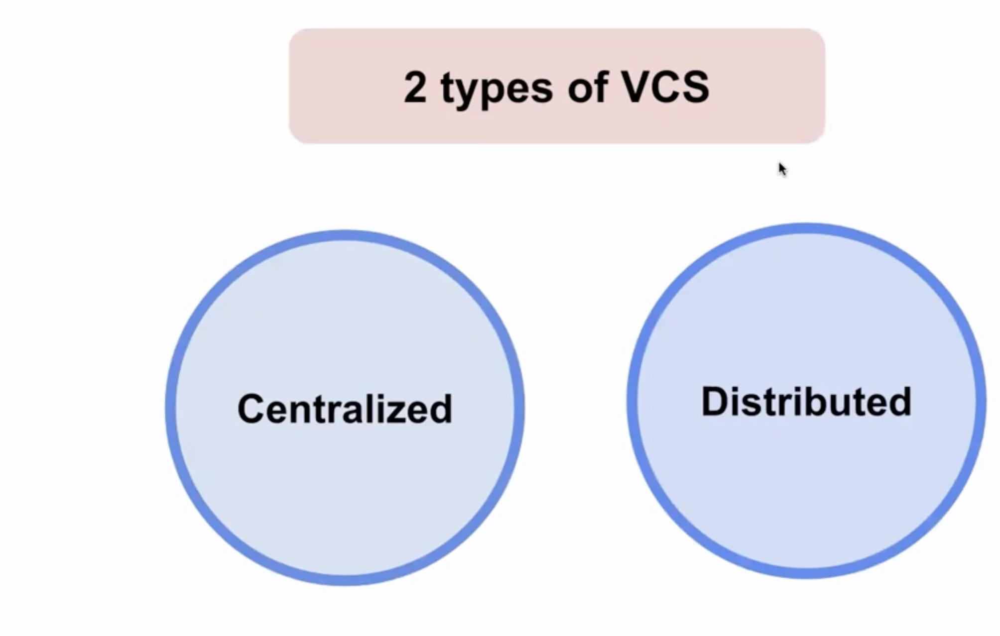
- Centralized version control system is good for small projects, not really good for big projects
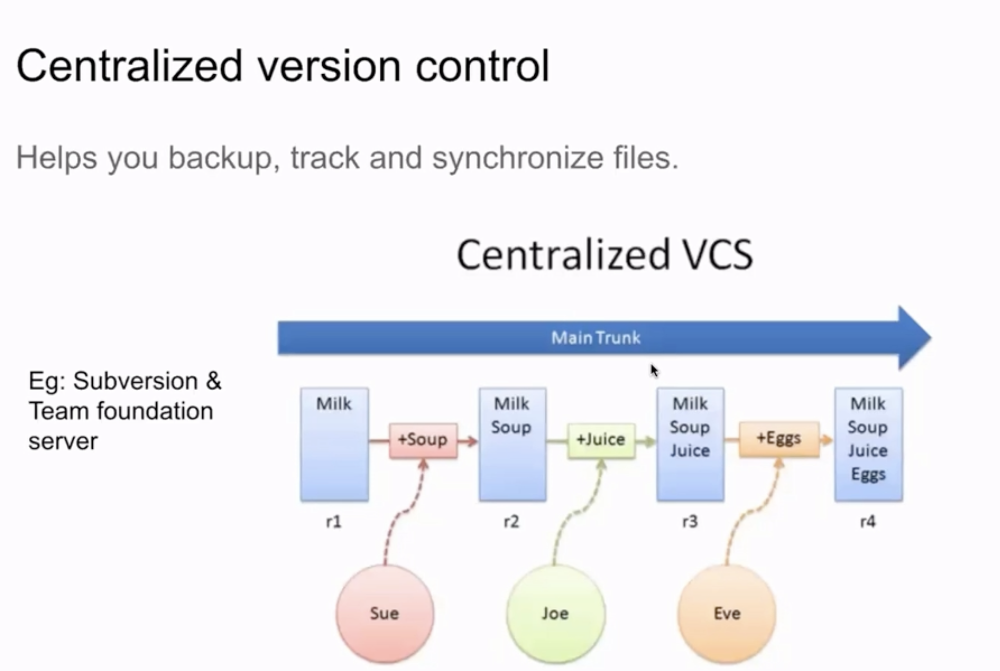

- Distributed version control system

    - You only need internet or being connected to internet when you want to publish your changes or want to pull others changes.
    - Here the people are not dependent on each other for making the changes, they can independently work together on a single project.

- Why Git?
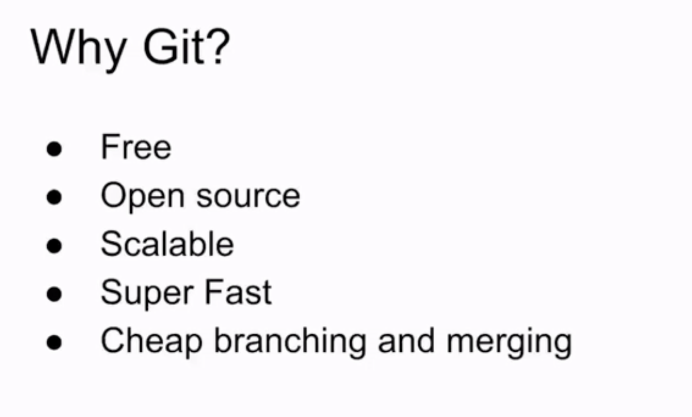

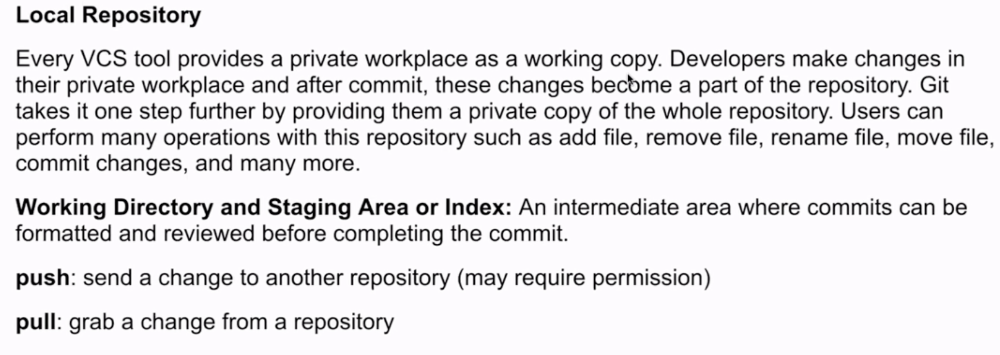
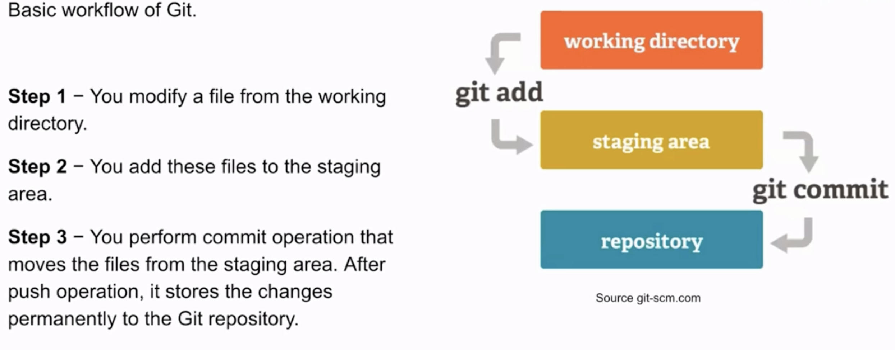
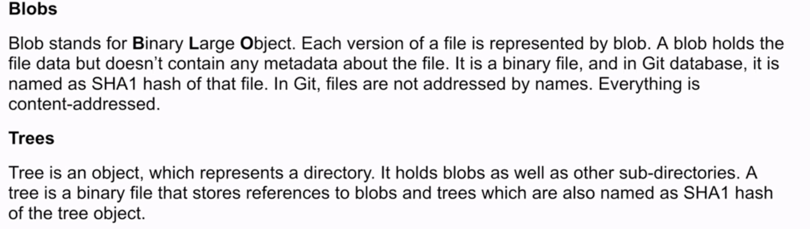
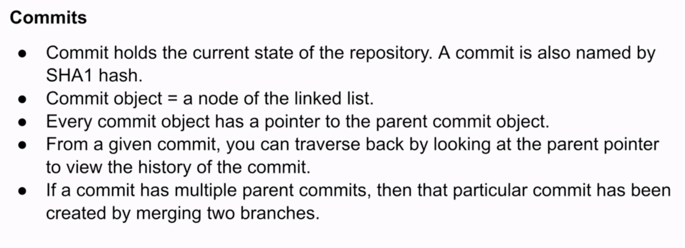
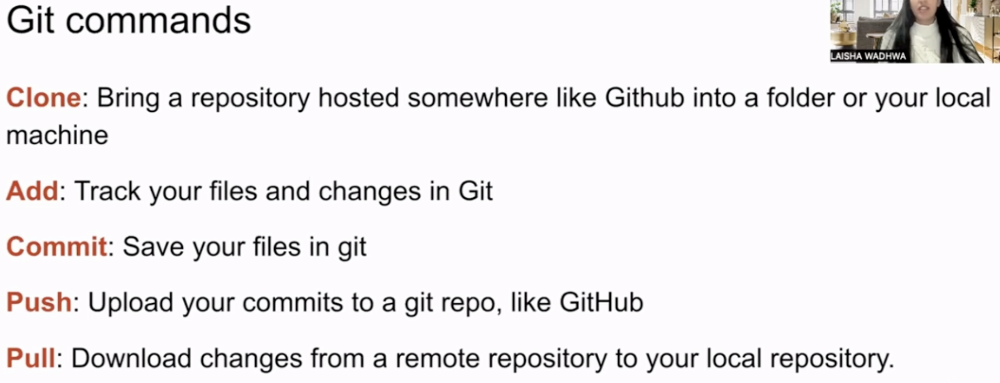
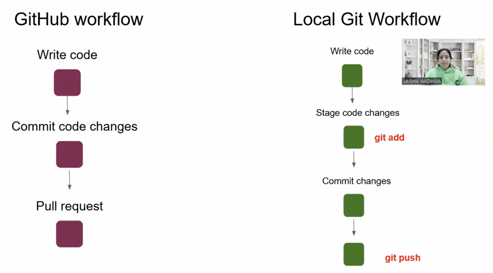

## Git commands
- git remote
    - `git remote -v` : Shows the remote repo connected
    - `git remote add origin REPO_URL` : Add a remote repo to local repo
    - `git push origin master`
- git commit
    - `git commit -am "message"` : You can directly commit your modified files using this.
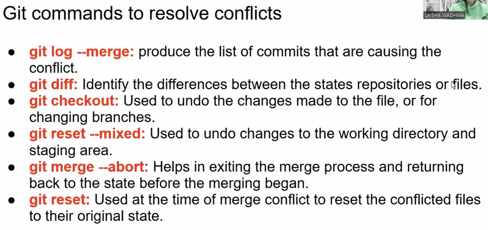

## Adding a SSH Keys to your GitHub Account
- `ssh-keygen -t rsa -b 4096 -C "your_email@example.com"` :Using this you can create your own public/ private key pair 

## Git Branching
- There can be multiple people working on a project, multiple features. So, in that case you need a way to keep the main code and make a copy of the code and work on that. This is possible due to branching.
- Branching is very common thing that is used in the VCS.
- The process of making a changes from one branch to the other in a sync is called the process of merging.
- We have main branch where we keep our latest and stable code.
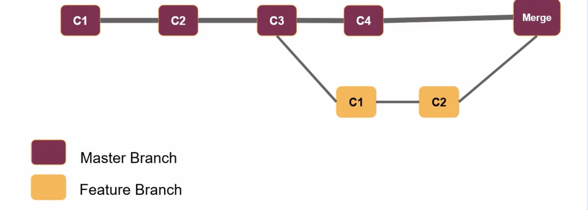
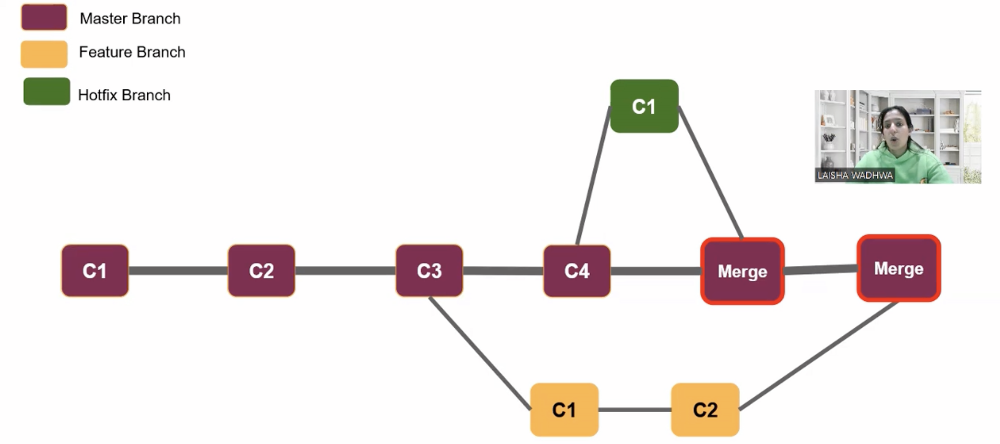
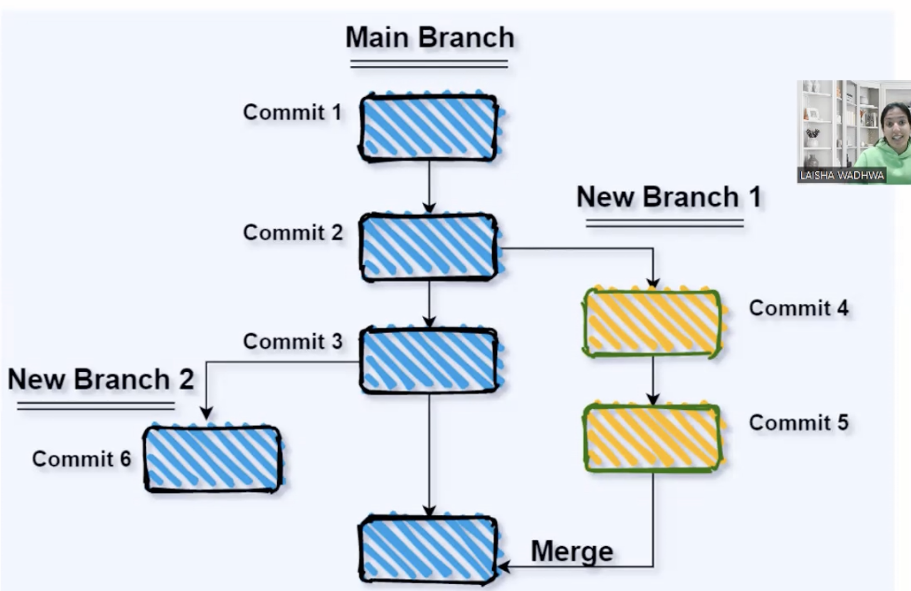

## Git Merge Conflict
- HEAD: Branch where you execute merge command.
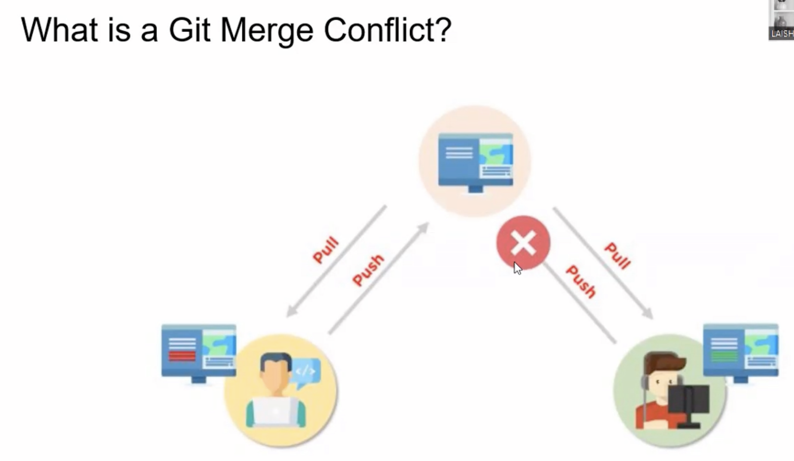
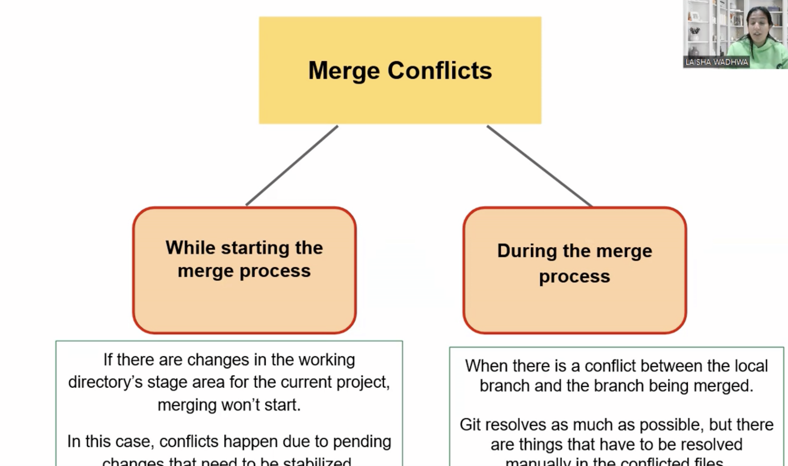
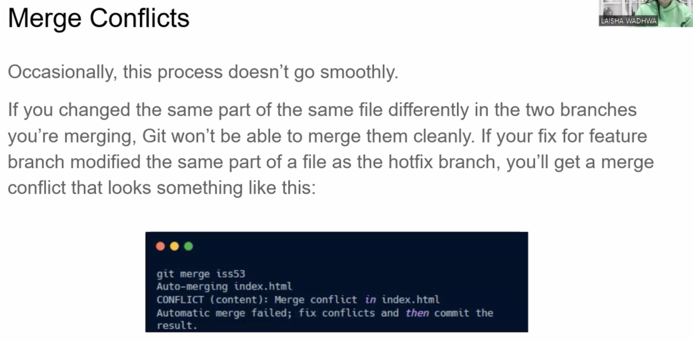
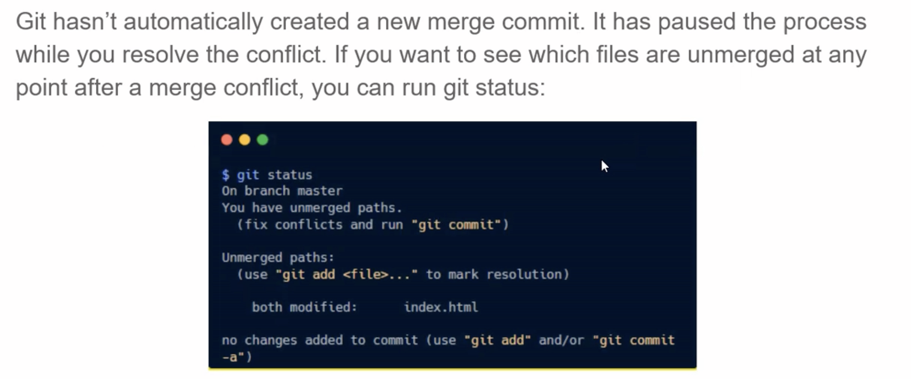
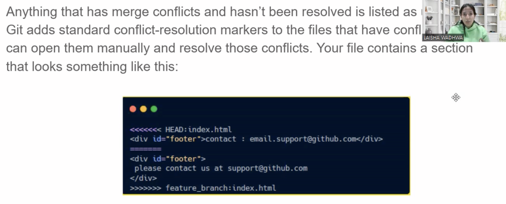
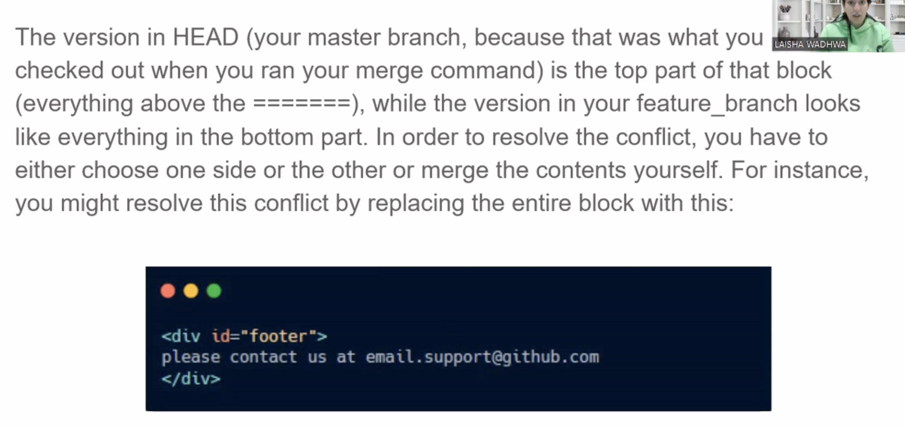
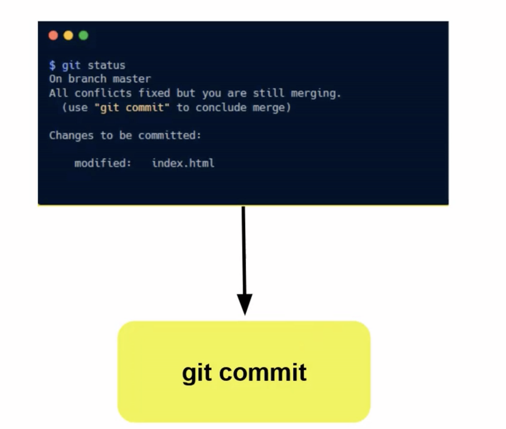

## Git Stash
- Let's keep your changes aside for a moment and later you can work on these changes.

## Git Issues
- It is a good way to collaborate
- You can connect the issue with the PR. After merging the PR the issue associated with the branch gets automatically closed.
- You can also look at "Link PR to issue" article in GitHub Docs

## Git Patch